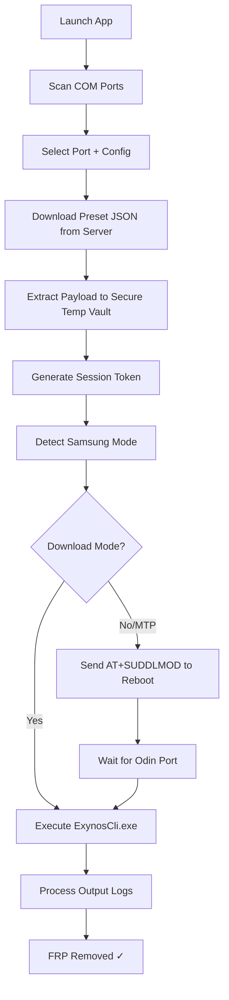

# Samsung Exynos FRP Source Code with All Presets

**Powered by Tfast Digital** | [tfastdigital.com](https://tfastdigital.com)

[](LICENSE)
[](https://dotnet.microsoft.com/download/dotnet/8.0)
[]()

---

## 📖 Overview

This repository contains the **full source code** for the Samsung Exynos FRP (Factory Reset Protection) removal tool — a .NET 8.0 Windows Forms application that removes FRP/ZeroKnox protection from Samsung Exynos-powered devices. The project includes the complete UI, engine integration, and **all device preset configurations** (48 JSON files).

---

## ✨ Features

- 🖥️ **Modern Windows Forms UI** with dark theme
- 🔌 **Automatic COM port scanning** for Samsung devices
- 📡 **Remote preset loading** from config server with local fallback
- 🧠 **Auto chipset detection** via AT commands over serial (115200 baud)
- 📦 **Embedded secure payload** extracted to encrypted temp vault
- 📋 **Live log output** with color-coded status messages
- 📊 **Progress tracking** with progress bar and status labels
- ⏹️ **Cancellable operations** with stop button
- 🔄 **Automatic Download Mode detection** (PID_6601) and port switching

---

## 📦 Included Presets (48 Files)

### Extract Method Presets

| File | Chipset |
|------|---------|
| `exynos850_dpolicy_extract.json` | Exynos 850 |
| `exynos7884_dpolicy_extract.json` | Exynos 7884 / 7884B |
| `exynos7885_dpolicy_extract.json` | Exynos 7885 |
| `exynos1280_dpolicy_extract.json` | Exynos 1280 |
| `exynos1330_dpolicy_extract.json` | Exynos 1330 |
| `exynos1380_dpolicy_extract.json` | Exynos 1380 |
| `exynos1480_dpolicy_extract.json` | Exynos 1480 |
| `exynos1580_dpolicy_extract.json` | Exynos 1580 |
| `exynos2100_dpolicy_extract.json` | Exynos 2100 |
| `exynos2200_dpolicy_extract.json` | Exynos 2200 |
| `exynos2400_dpolicy_extract.json` | Exynos 2400 |
| `exynos2500_dpolicy_extract.json` | Exynos 2500 |
| `galaxy_a12_dpolicy_extract.json` | Galaxy A12 Special |
| `exynos7884_dpolicy_extract_no_payload.json` | Exynos 7884 (no payload variant) |
| `exynos850_dpolicy_extract_no_payload.json` | Exynos 850 (no payload variant) |

### Integrity Method Presets

| File | Chipset |
|------|---------|
| `exynos7570_dpolicy_integrity.json` | Exynos 7570 |
| `exynos7870_dpolicy_integrity.json` | Exynos 7870 |
| `exynos7880_dpolicy_integrity.json` | Exynos 7880 |
| `exynos7904_dpolicy_integrity.json` | Exynos 7904 |
| `exynos8890_dpolicy_integrity.json` | Exynos 8890 |
| `exynos8895_dpolicy_integrity.json` | Exynos 8895 |
| `exynos9610_dpolicy_integrity.json` | Exynos 9610 |
| `exynos9611_dpolicy_integrity.json` | Exynos 9611 |
| `exynos980_dpolicy_integrity.json` | Exynos 980 |
| `exynos9810_dpolicy_integrity.json` | Exynos 9810 |
| `exynos9820_dpolicy_integrity.json` | Exynos 9820 |
| `exynos9825_dpolicy_integrity.json` | Exynos 9825 |
| `exynos990_dpolicy_integrity.json` | Exynos 990 |
| `generic_dpolicy_integrity_185720.json` | Generic Integrity |

Plus **19 additional build-specific variant presets** for Exynos 9610, 9820, 990, and 7904.

---

## 📱 Supported Devices & Chipsets

| Chipset | Model ID | Galaxy Devices |
|---------|----------|----------------|
| Exynos 850 | S5E3830 | Galaxy A12 / A02s / A03s / M12 |
| Exynos 1280 | S5E8825 | Galaxy A33 5G / A53 5G / M33 |
| Exynos 1330 | S5E8830 | Galaxy A34 5G / A54 5G variants |
| Exynos 1380 | S5E8835 | Galaxy A34 5G / A54 5G |
| Exynos 1480 | S5E8845 | Galaxy A35 5G / A55 5G |
| Exynos 1580 | S5E8855 | Galaxy A36 5G / A56 5G |
| Exynos 2100 | S5E9840 | Galaxy S21 Series |
| Exynos 2200 | S5E9925 | Galaxy S22 Series |
| Exynos 2400 | S5E9945 | Galaxy S24 Series |
| Exynos 2500 | S5E9955 | Galaxy S25 Series |
| Exynos 7570 | S5E7570 | Galaxy J2 / J3 / J5 |
| Exynos 7870 | S5E7870 | Galaxy J5 2017 / J7 2017 |
| Exynos 7880 | S5E7880 | Galaxy A5 2017 / A7 2017 |
| Exynos 7884 | S5E7884 | Galaxy A10 / A20e / A30s |
| Exynos 7885 | S5E7885 | Galaxy A30 / A40 |
| Exynos 7904 | S5E7904 | Galaxy M20 / M30 / A20 / A30 |
| Exynos 8890 | S5E8890 | Galaxy S7 / S7 Edge |
| Exynos 8895 | S5E8895 | Galaxy S8 / S8+ / Note 8 |
| Exynos 9610 | S5E9610 | Galaxy A50 / A50s |
| Exynos 9611 | S5E9611 | Galaxy A51 / M31 / M21 |
| Exynos 980 | S5E9630 | Galaxy A71 5G |
| Exynos 9810 | S5E9810 | Galaxy S9 / S9+ / Note 9 |
| Exynos 9820 | S5E9820 | Galaxy S10 / S10+ / Note 10 |
| Exynos 9825 | S5E9825 | Galaxy Note 10+ |
| Exynos 990 | S5E9830 | Galaxy S20 / Note 20 |

---

## 🔧 Build Requirements

- **Windows 10 / 11** (x64)
- **[.NET 8.0 SDK](https://dotnet.microsoft.com/download/dotnet/8.0)**
- **Visual Studio 2022+** with `.NET desktop development` workload
- `System.IO.Ports` NuGet package (auto-restored)

---

## 🚀 Quick Start

```bash
# Clone the repository
git clone https://github.com/tfastdigital/Samsung-Exynos-frp-source-code-with-all-presets-.git

# Navigate to project
cd Samsung-Exynos-frp-source-code-with-all-presets-

# Restore and build
dotnet restore
dotnet build -c Release

# Run
dotnet run
```

Or open `SamsungExynos.slnx` in Visual Studio, restore NuGet packages, and press **F5**.

---

## 📘 How to Use

1. **Connect** your Samsung Exynos device to the PC via USB
2. **Launch** `TFT Unlock Tool Pro`
3. **Select** the detected COM port from the dropdown (or click 🔄 to refresh)
4. **Open** the Config dropdown — it will fetch presets from the server
5. **Choose** the preset matching your device's chipset
6. Click **▶ Reset FRP** to begin the removal process
7. Monitor progress in the log window
8. After success: if the device reconnects every 2 seconds after reboot, **perform a factory reset**

---

## 🧠 How It Works



The app communicates with the device over **UART serial (115200 baud)** using AT commands to detect the chipset model and firmware version. It then downloads the matching exploit preset, extracts the embedded payload (`ExynosCli.exe` + ramdisk), and boots the device into a custom ramdisk to patch the FRP partition.

---

## 🗂️ Repository Structure

```
├── SamsungExynos.slnx              # Visual Studio solution
├── SamsungExynos.csproj            # .NET 8.0 Windows Forms project
├── Program.cs                      # Application entry point
├── Form1.cs                        # Main UI logic & event handlers
├── Form1.Designer.cs               # Designer-generated UI code
├── Form1.resx                      # Form resources
├── ExynosFlashEngine.cs            # Core engine: detection, flash, serial
├── app.manifest                    # Windows app manifest
├── Properties/
│   ├── Resources.resx              # Embedded resources
│   └── Resources.Designer.cs       # Resource accessors
├── Resources/                      # Static resources
├── presets/                        # 48 device preset JSON files
├── README.md                       # This file
└── .gitignore                      # Git ignore rules
```

---

## 🌐 Remote Config Server

The application fetches presets from a remote server defined in `Form1.cs`:

```csharp
private const string ConfigServerUrl = "https://your.site/presets/";
```

To use your own preset server:
1. Update `ConfigServerUrl` to point to your host
2. Ensure JSON files are served with proper CORS headers
3. Presets are cached in temp and cleared after each operation

---

## ⚠️ Disclaimer

This project is intended for **authorized device servicing, repair, research, and educational purposes only**. Use only on devices you own or have explicit authorization to service. The authors and contributors assume no liability for misuse.

---

## 👤 Credits

- **Developed by:** Tfast Digital Agency
- **Website:** [tfastdigital.com](https://tfastdigital.com)
- **GitHub:** [@tfastdigital](https://github.com/tfastdigital)

---

## 📄 License

MIT License — see [LICENSE](LICENSE) file for details.

---

<p align="center">
  <sub>Built with ❤️ by Tfast Digital | © 2026</sub>
</p>